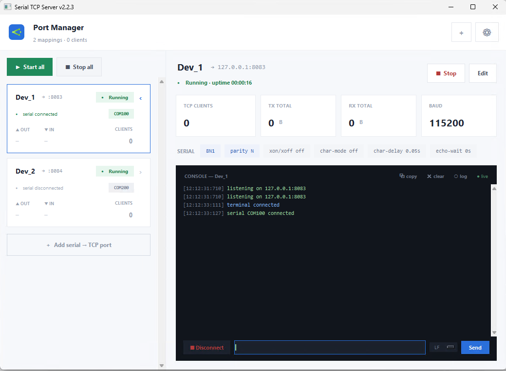

# serial-tcp-server

TCP server for sharing a serial console across multiple TCP clients.

```
clientA <-->\
             | <-----> TcpServer <---> serial port
clientB <-->/
```

The serial port opens when the first client connects and closes when
the last client disconnects. If the serial device is lost, all TCP
clients are kept connected while the server attempts to reconnect.

Works on Windows and Linux (including Raspberry Pi).

## Requirements

- Python >= 3.9
- pyserial >= 3.3

## Install

```bash
pip install serial-tcp-clients
```

This installs the **CLI/backend only** (depends on `pyserial` alone — no GUI, no
Tkinter, no PyYAML). For the desktop app see [GUI (Port Manager)](#gui-port-manager),
which is a separate `serial-tcp-clients-gui` package.

Or from source:

```bash
git clone https://github.com/maslovw/serial_tcp_clients.git
cd serial_tcp_clients
pip install .
```

## Usage

```bash
serial-tcp-server -p PORT -d DEVICE -b BAUDRATE
```

Or via module:

```bash
python -m serialtcp -p PORT -d DEVICE -b BAUDRATE
```

### Arguments

```
optional arguments:
  -h, --help            show this help message and exit
  --list                print list of serial devices
  -v {debug,info,warn,error,fatal}, --verbose {debug,info,warn,error,fatal}
                        logger level, default: error

TCP connection:
  -p TCP_PORT, --tcp-port TCP_PORT
                        TCP listen port

serial port:
  -d DEVICE, --device DEVICE
                        serial port/device
  -b BAUDRATE, --baudrate BAUDRATE
                        default: 115200
  --parity {N,E,O,S,M}  set parity, one of {N E O S M}, default: N
  --xonxoff             enable software flow control (default off)
  -cd CHAR_DELAY, --char-delay CHAR_DELAY
                        set delay between chars for serial transmission,
                        default: 0.0s
  -we WAIT_ECHO, --wait-echo WAIT_ECHO
                        wait for echo char when transmitting, value represents
                        timeout in seconds, default: 0
```

### Example

```bash
serial-tcp-server -p 5001 -d COM1 -b 921600 -v info -we 1
```

Use `-v debug` to send connection status messages (device, baudrate,
connect/disconnect events) to TCP clients.

## GUI (Port Manager)

A separate **Tkinter desktop app** (the `serial-tcp-clients-gui` package, built on
the CLI/backend) manages **many** serial -> TCP mappings at once from a single
YAML config. It uses a master-detail layout: a list of port cards on the left,
and the selected port's console, settings, throughput and live log on the right.



For each mapping you can Start/Stop the TCP listener, watch live OUT/IN
throughput, the connected-client count and the serial device's link state
(a green/grey port chip), read a colour-coded console, send data to the serial
device from a console input line, and Add/Edit/Remove
mappings. The serial port opens when the first TCP client connects and closes
when the last disconnects; if the device drops, the clients stay connected while
the GUI shows a "reconnecting" banner and retries.

### Requirements

- Python >= 3.9
- pyserial >= 3.3 and PyYAML >= 5.1 (both pulled in by the `[gui]` extra)
- Tkinter — bundled with the standard Python installers on **Windows** and
  **macOS**. On Linux, install it from your package manager
  (Debian/Ubuntu: `sudo apt install python3-tk`).

### Build / install

**From PyPI:**

```bash
pip install serial-tcp-clients-gui
```

The GUI is its own package; it pulls in the CLI/backend package
(`serial-tcp-clients`) and PyYAML automatically.

**From source (recommended for development) — Windows:**

```bat
git clone https://github.com/maslovw/serial_tcp_clients.git
cd serial_tcp_clients
python -m venv .venv
.venv\Scripts\activate
pip install -e . -e gui
```

**From source — Linux / macOS:**

```bash
git clone https://github.com/maslovw/serial_tcp_clients.git
cd serial_tcp_clients
python3 -m venv .venv
source .venv/bin/activate
pip install -e . -e gui
```

**Standalone Windows executable (no Python needed on the target machine):**

```bat
deploy\build-gui.bat
```

This uses PyInstaller to produce the windowed binary `serial-tcp-gui.exe` and the
console client `serial-tcp-ctl.exe` in the repository root. It builds in a
throwaway virtualenv, so it does not touch your working `.venv`. Pass an explicit
interpreter if `python` is not on your PATH:
`deploy\build-gui.bat C:\Python310\python.exe`.

### Start / run

With the package installed (console script on PATH):

```bash
serial-tcp-gui                 # loads ./serialtcp_ports.yaml if present
serial-tcp-gui ports.yaml      # load a specific config
```

As a module (works without the console script on PATH):

```bash
python -m serialtcp_gui ports.yaml
```

From a source venv on Windows, or the standalone build:

```bat
.venv\Scripts\serial-tcp-gui.exe ports.yaml
serial-tcp-gui.exe ports.yaml
```

If no config path is given, the app uses `./serialtcp_ports.yaml`. Any mapping
you Add/Edit/Remove in the GUI is **saved back** to that file.

### Configuration file

A YAML file with a `ports:` list; each entry binds one serial device to one TCP
listen port. Only `device` and `tcp_port` are required — everything else has
sensible defaults.

```yaml
ports:
  - name: COM103          # optional label (defaults to the device name)
    device: COM103        # COM103 on Windows, /dev/ttyUSB0 on Linux
    tcp_port: 5000        # TCP port that clients connect to
    baudrate: 921600
    parity: N             # one of N E O S M
    xonxoff: false        # software flow control
    char_mode: false      # send characters one at a time
    char_delay: 0.0       # seconds between characters
    wait_echo: 0.0        # seconds to wait for echo per character
    line_ending: CRLF     # console send newline: CRLF | LF | CR | none
    log_file: ''          # path to log all serial activity ('' = off)
    allow_remote: false   # false = listen on 127.0.0.1 only; true = 0.0.0.0
    autostart: true       # start listening as soon as the GUI opens
```

By default a mapping listens on **`127.0.0.1`** (localhost only), so the serial
console is not exposed on the network. Set `allow_remote: true` (or tick
**Allow remote connections** in the Add/Edit dialog) to bind `0.0.0.0` and accept
connections from other machines.

The same file also holds the optional `logging:` block (the app's own Python
logger) and the `api:` block ([REST control API](#rest-control-api)).

A ready-to-edit example lives in [`ports.example.yaml`](ports.example.yaml).

### Using it

- **Start / Stop** a port from its card or the detail panel; **Start all** and
  **Stop all** are in the top bar.
- **＋ Add serial → TCP port** (top bar or the dashed list footer) opens a dialog
  to choose the serial device, baudrate, parity, flow/char options and the TCP
  listen port. **Edit** changes a mapping; **Remove** deletes a stopped one.
- Connect any TCP client to the listen port to talk to the device, e.g.:

  ```bash
  telnet localhost 5000
  ```

  or PuTTY (connection type *Raw* or *Telnet*, host `localhost`, port `5000`),
  or `nc localhost 5000`. Several clients can share one serial device at once.
- **Console** — the live log timestamps each line `[HH:MM:SS:MSEC]`, renders
  ANSI colours and splits CR/CRLF/LF lines; scroll back through history with the
  scrollbar or mouse wheel. The header has **copy** (the selection, or the whole
  console) and **clear** buttons. The input row sends what you type; the dropdown
  next to it picks the appended line ending (`CRLF`/`LF`/`CR`/`none`), which is
  saved to the config.
- **Terminal as a client** — the serial port is normally open only while a TCP
  client is connected. Click **Connect** in the console input row to attach the
  GUI itself as a client (opening the serial port) so you can send and receive in
  the integrated terminal with no external client connected; **Disconnect**
  releases it (and closes the port if nothing else is using it).
- **Logging** — click **log** in the console header (or set `log_file` in the
  config / dialog) to record all serial activity to a file. Each line is stamped
  `[dd.mm.YY HH:MM:SS:MSEC]`.

### REST control API

The Port Manager can serve a small **HTTP/JSON API** (FastAPI + uvicorn) so
scripts, CI jobs and monitoring tools can check that the app is healthy, read its
configuration and the live state of every mapping, and add, configure, start or
stop mappings without touching the window. Everything the API changes is applied
to the running app and saved back to the YAML config, exactly like the equivalent
click in the GUI.

**Install** — the API ships as an extra, so the plain GUI install stays small:

```bash
pip install "serial-tcp-clients-gui[api]"
```

Without those packages the GUI runs as before and logs that the API was not
started. The standalone Windows build (`deploy\build-gui.bat`) always includes it.

**Configure** — the top-level `api:` block of the config file:

```yaml
api:
  enabled: true        # false = do not start the HTTP server
  host: 127.0.0.1      # 0.0.0.0 exposes it on the network
  port: 410            # HTTP listen port (default)
```

Defaults are `enabled: true`, `host: 127.0.0.1`, `port: 410`, so out of the box
the API answers on <http://localhost:410> and is reachable only from the machine
running the GUI. The settings menu (gear icon) shows the URL the API is serving,
or `off`.

> **Note** — on Linux/macOS ports below 1024 are privileged: either run the app
> with the right privileges or pick a higher `port`. Windows has no such limit.
> The API has **no authentication**; only set `host: 0.0.0.0` on a trusted
> network, and remember it can open serial ports on the machine.

**Documentation** — the API documents itself: Swagger UI at
<http://localhost:410/docs>, ReDoc at `/redoc`, the OpenAPI schema at
`/openapi.json`.

| Method + path | Does |
|---|---|
| `GET /health` | App health: `ok` (or `degraded` while a started mapping lost its device), version, uptime, config path, client count and how many mappings are running / reconnecting / stopped |
| `GET /config` | Full configuration: config file path, logger settings, API settings and every mapping |
| `GET /ports` | Live state of every mapping |
| `GET /ports/{tcp_port}` | Live state of one mapping |
| `POST /ports` | Add a mapping (created stopped) |
| `PATCH /ports/{tcp_port}` | Change a mapping; only the fields sent are applied, and a running mapping is restarted |
| `DELETE /ports/{tcp_port}` | Stop and remove a mapping |
| `POST /ports/{tcp_port}/start` | Start one mapping's TCP server |
| `POST /ports/{tcp_port}/stop` | Stop one mapping's TCP server |
| `POST /ports/start-all` | Start every mapping (per-mapping failures come back in `errors`) |
| `POST /ports/stop-all` | Stop every mapping |

Mappings are addressed by their **TCP listen port**. Errors use standard codes:
`404` unknown mapping, `409` port already mapped or the listener could not be
bound, `422` invalid value, `503` the app did not respond in time.

```bash
curl http://localhost:410/health
curl http://localhost:410/ports

# add a mapping and start it
curl -X POST http://localhost:410/ports \
     -H 'Content-Type: application/json' \
     -d '{"device": "COM103", "tcp_port": 5000, "baudrate": 921600, "name": "Target"}'
curl -X POST http://localhost:410/ports/5000/start

# change the baudrate (restarts it if running) and stop it again
curl -X PATCH http://localhost:410/ports/5000 \
     -H 'Content-Type: application/json' -d '{"baudrate": 115200}'
curl -X POST http://localhost:410/ports/5000/stop
```

#### `serial-tcp-ctl` — command-line client

The GUI package also installs **`serial-tcp-ctl`**, a command-line counterpart of
the API: one subcommand per endpoint, formatted output instead of raw JSON. It
uses only the standard library (no Tkinter, no FastAPI), so it also runs on a
machine that just talks to a Port Manager elsewhere.

```bash
serial-tcp-ctl health                 # alive? how many mappings, how many clients
serial-tcp-ctl ports                  # one table row per mapping (alias: list)
serial-tcp-ctl show 5000              # everything about one mapping
serial-tcp-ctl config                 # config file, logging, api settings, mappings
serial-tcp-ctl add COM103 5000 --baudrate 921600 --name Target --start
serial-tcp-ctl set 5000 --baudrate 115200 --line-ending LF
serial-tcp-ctl start 5000             # or: start all
serial-tcp-ctl stop 5000              # or: stop all
serial-tcp-ctl remove 5000            # alias: rm
```

```
$ serial-tcp-ctl ports
TCP    STATUS   LINK  DEVICE        BAUD    CLIENTS  IN     OUT     UPTIME    NAME
5000   running  up    COM103        921600  2        86 KB  1.0 KB  00:02:08  Target
5002   stopped  -     /dev/ttyUSB0  57600   0        0 B    0 B     00:00:00  -
```

`add` and `set` accept the mapping options as flags: `--name`, `--baudrate`,
`--parity`, `--line-ending`, `--log-file`, `--char-delay`, `--wait-echo`, and the
switches `--autostart/--no-autostart`, `--allow-remote/--no-allow-remote`,
`--xonxoff/--no-xonxoff`, `--char-mode/--no-char-mode`. `set` only sends the
options you pass, and `--tcp-port` moves a mapping to another listen port.

The target is taken from the `api:` block of `./serialtcp_ports.yaml` (or `-c
FILE`), falling back to `http://127.0.0.1:410`. Override it with `--url`, which
accepts a port (`--url 411`), a `host:port` or a full URL — handy for a Port
Manager on another machine. Add `--json` for the raw API response, `-v` to trace
the HTTP exchange, and `--timeout` to change the 10 s request timeout. Exit
status is `0` on success, `1` on a request or connection error, `2` on bad usage.

Without the console script on PATH the same client runs as
`python -m serialtcp_gui.cli`; the Windows build produces `serial-tcp-ctl.exe`
next to `serial-tcp-gui.exe`.

A port state looks like this:

```json
{
  "tcp_port": 5000,
  "label": "Target",
  "device": "COM103",
  "status": "running",
  "running": true,
  "serial_connected": true,
  "clients": 2,
  "terminal_connected": false,
  "uptime_s": 128.4,
  "tx_bytes": 1024,
  "rx_bytes": 88320,
  "reconnect_attempt": 0,
  "listening_on": "127.0.0.1:5000",
  "logging_to_file": false,
  "config": { "device": "COM103", "tcp_port": 5000, "baudrate": 921600, "...": "..." }
}
```
